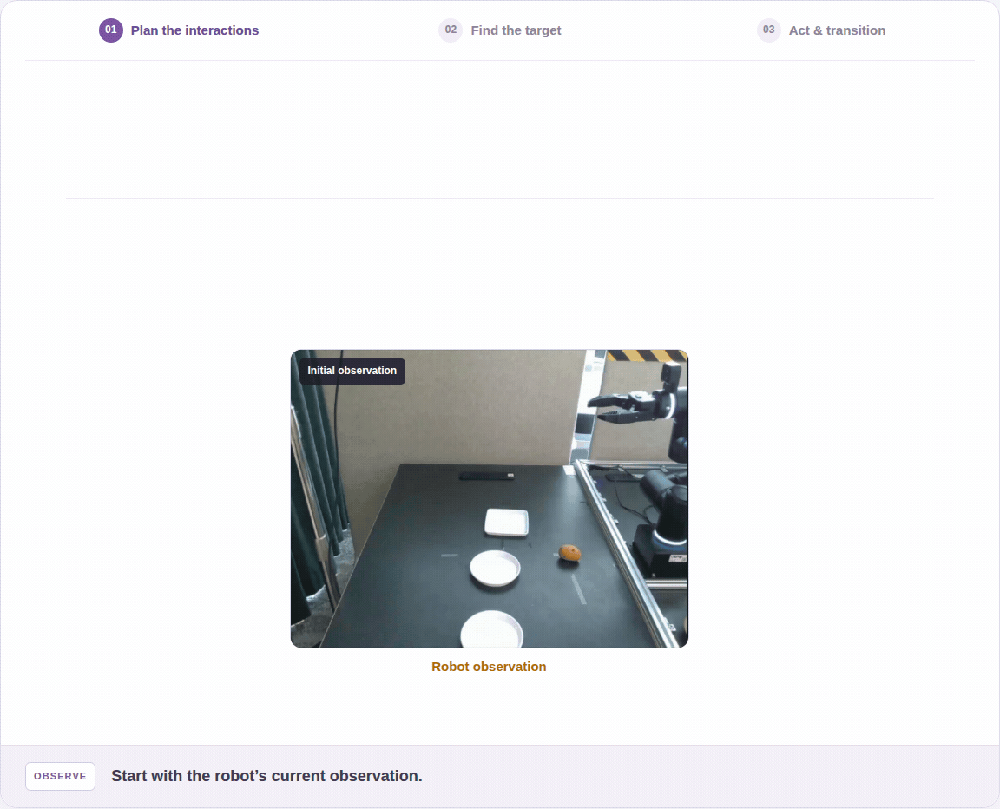

<h1 align="center">RAIN<br><sub>Robotic Task Generalization with Region-Aware Interaction Networks</sub></h1>

<p align="center">
  <a href="https://seung-hun-lee.github.io/projects/RAIN/"></a>
  
  <a href="benchmarks/LIBERO-Analogy/README.md"></a>
</p>

<p align="center">
  <a href="#overview">Overview</a> ·
  <a href="#models-and-data">Models &amp; Data</a> ·
  <a href="#inference">Inference</a> ·
  <a href="#training">Training</a> ·
  <a href="#libero-analogy">LIBERO-Analogy</a>
</p>

## Overview

RAIN learns robotic interactions conditioned on target regions and action types.
It predicts actions from visual observations and robot state. Its Transition
Head determines when a subtask is complete and the robot can proceed to the next.

<p align="center">
  <a href="https://seung-hun-lee.github.io/projects/RAIN/#pipeline">
    
  </a>
</p>

This repository includes training, evaluation, ablations, and LIBERO-Analogy.

## Models and data

| Artifact | Contents | Distribution |
|---|---|---|
| RAIN model | LIBERO-trained action policy and Transition Head | [🤗 Hugging Face](https://huggingface.co/Seunghun5688/RAIN) · 0.70 GB |
| Training data | Successful LIBERO replays with masks, subtask labels, actions, and robot states | [🤗 Hugging Face](https://huggingface.co/datasets/Seunghun5688/RAIN-LIBERO) · 73.8 GB |
| LIBERO-Analogy | 60 tasks, initial states, success rules, and evaluator | [Included in this repository](benchmarks/LIBERO-Analogy/README.md) |

See [download and setup](docs/artifacts.md).

## Setup

Use a dedicated Python 3.10 environment on Linux. From this repository root:

```bash
python3.10 -m venv .venv
source .venv/bin/activate
python -m pip install -e '.[eval,test]'
python -m pip install -e './benchmarks/LIBERO-Analogy[sim,test]'
python -m pytest -q
```

Configure CUDA/EGL and the simulator assets using the
[benchmark setup guide](benchmarks/LIBERO-Analogy/README.md#install).
Standard LIBERO requires its own asset paths.

Set the roots of your unpacked data and downloaded model:

```bash
export RAIN_DATA_ROOT=/absolute/path/to/rain-data
export RAIN_MODEL_ROOT=/absolute/path/to/rain-model
```

## Inference

Run one episode with simulator/GT masks. `checkpoint.pt` contains the action
policy and Transition Head. This simulation setup uses third-person and wrist
camera observations.

**LIBERO**

```bash
python -m rain.eval_libero \
  --checkpoint "$RAIN_MODEL_ROOT/checkpoint.pt" \
  --episodes-json "$RAIN_DATA_ROOT/annotations/final_full.json" \
  --benchmark libero_spatial --tasks 0 --episode-ids 0 \
  --gpus 0 --save-dir outputs/libero_smoke
```

**LIBERO-Analogy**

```bash
python -m rain.eval_analogy \
  --benchmark-root benchmarks/LIBERO-Analogy \
  --checkpoint "$RAIN_MODEL_ROOT/checkpoint.pt" \
  --task-ids Decompose_001 --episode-ids 0 \
  --gpu 0 --save-dir outputs/analogy_smoke
```

For full evaluation, remove task/episode filters and add `--episodes-per-task 50`.
Run LIBERO separately for `libero_spatial`, `libero_object`, `libero_goal`, and
`libero_10` (Long). An unfiltered Analogy run covers all 60 tasks.

## Training

First [unpack the dataset](docs/artifacts.md) and
[prepare the frozen image/text features](docs/core.md#data-and-feature-preparation).
Then train the action policy, followed by the Transition Head:

```bash
# Stage 1: action policy.
python -m rain.train action \
  --data-root "$RAIN_DATA_ROOT" --output-root outputs --execute

# Stage 2: run after Stage 1 finishes; use its checkpoint and config.
python -m rain.train transition \
  --data-root "$RAIN_DATA_ROOT" --output-root outputs \
  --action-checkpoint outputs/action_full/checkpoints/checkpoint_final.pt \
  --action-config outputs/action_full/config.json --execute
```

Defaults use multi-stage features, mask augmentation, 100k action steps, and
global batch 1024. The Transition Head uses target-region pooling and gated view
fusion. It is trained from random initialization with the action network frozen,
without distance/alignment losses.
See [training and ablation options](docs/core.md#training-and-ablations).

## LIBERO-Analogy

LIBERO-Analogy has 20 tasks each for Adapt, Compose, and Decompose: adapting to
changed layouts and goals, combining learned skills, and executing part of a
learned sequence. The standalone evaluator supports RAIN and other policies.

[Task list](benchmarks/LIBERO-Analogy/TASKS.md) ·
[π₀.₅ example](benchmarks/LIBERO-Analogy/README.md#evaluate-π₀₅) ·
[Policy interface](benchmarks/LIBERO-Analogy/README.md#other-policies) ·
[Videos](https://seung-hun-lee.github.io/projects/RAIN/gallery.html)

## Reported results

Success rates (%) from the manuscript, using simulator/GT masks and
50 episodes per task:

| LIBERO Spatial | Object | Goal | Long | Average |
|---:|---:|---:|---:|---:|
| 93.6 | 99.0 | 95.2 | 93.6 | **95.4** |

| LIBERO-Analogy Adapt | Compose | Decompose | Average |
|---:|---:|---:|---:|
| 62.4 | 37.1 | 82.7 | **60.7** |

See [reproduction notes](docs/reproduction.md) for checkpoint selection and
evaluation conditions.

## Documentation

| Topic | Guide |
|---|---|
| Data layout and downloads | [Artifacts](docs/artifacts.md) |
| Paper modules, feature preparation, training, and ablations | [Core implementation](docs/core.md) |
| Checkpoints and evaluation conditions | [Reproduction](docs/reproduction.md) |
| LIBERO-Analogy setup and other policies | [Benchmark guide](benchmarks/LIBERO-Analogy/README.md) |

## Citation and acknowledgments

The paper link and citation will be added when available. RAIN builds on
LIBERO, DINOv2, CLIP, PyTorch, robosuite, and MuJoCo; see [NOTICE.md](NOTICE.md).
